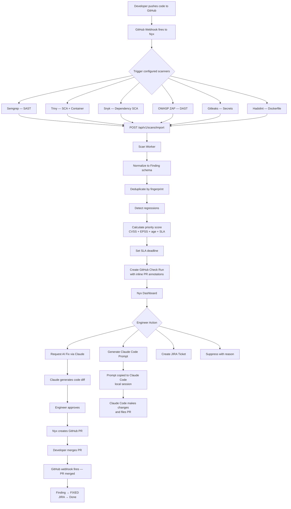
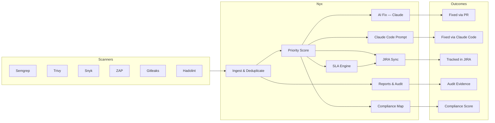

# Nyx: A Security Intelligence Platform I Built to Stop Drowning in Scanner Noise

*Tags: security, open-source, devsec, tooling, AI*

---

There is a problem that every engineering team with more than a handful of repositories eventually runs into, and nobody talks about it honestly: **security tooling generates an overwhelming amount of noise, and almost none of it turns into action.**

You install Semgrep. You add Trivy to your CI pipeline. Maybe you pick up Snyk for dependency scanning. Each one does its job — they find real vulnerabilities. But what you end up with is four dashboards, three Slack channels of alerts, a Jira backlog nobody owns, and a growing sense that your "security program" is mostly theatre.

I built **Nyx** to fix that — for myself, and for any team dealing with the same thing.

---

## What Is Nyx?

Nyx is a self-hosted security intelligence platform. It sits between your scanners and your engineers, ingesting results from every tool you already run — SAST, DAST, SCA, container scanning, IaC linting, secrets detection — deduplicating them, scoring them by real-world exploitability, and giving you a single coherent view of what actually matters and what is progressing.

The name comes from the Greek goddess of night. She illuminates what others cannot see. I thought that fit.

> **Nyx is currently experimental.** I am shipping changes daily, sometimes multiple times a day. The core platform is functional and I am running it against real repositories, but APIs may shift, the database schema is still evolving, and there are rough edges. If you are interested in trying it out, I would love to have early testers — more on that at the end.

---

## The Problem It Solves

Here is the typical lifecycle of a security finding without a platform like Nyx:

1. Scanner runs in CI. Produces JSON output.
2. JSON is... somewhere. Maybe uploaded to a tool. Maybe ignored.
3. A critical vulnerability shows up. Gets a Jira ticket. Maybe.
4. The ticket sits in a backlog for months.
5. The same vulnerability is reported again by a different scanner on the next commit.
6. A duplicate Jira ticket is created.
7. An auditor asks for evidence of your vulnerability management process. Panic.

The root cause is that there is no connective tissue. No single place that owns the lifecycle from *detected* to *fixed*, with full audit trail, SLA tracking, and compliance visibility.

That is what Nyx is.

---

<!-- IMAGE BREAK: Screenshot of the Nyx main dashboard — KPI cards at the top (Total Open, Critical Count, SLA Breached, Regressions), the Open by Severity donut chart, the 30-day Findings Trend chart, and the Repository Risk Table. This is the "first thing you see" shot. -->

---

## Who Is This For?

Nyx is aimed at a specific audience:

- **Small to mid-size engineering teams** who run multiple scanners but do not have a dedicated AppSec platform like Snyk Enterprise or Veracode
- **Solo security engineers** managing coverage across a large number of repositories without enough headcount to stay on top of everything manually
- **Startups preparing for SOC 2 or PCI DSS audits** who need compliance mapping and audit trails but cannot afford enterprise tooling
- **DevOps engineers** who want security gates in CI/CD without managing yet another SaaS dashboard

It is not for teams who already have a mature AppSec program with dedicated tooling budgets. There are better-resourced products for that use case. Nyx is for people who are doing more with less.

---

## How It Works: The Data Flow

Here is the end-to-end lifecycle of a finding in Nyx:

The key insight here is that Nyx does not replace your scanners — it orchestrates them. Each scanner keeps doing what it is good at. Nyx handles everything after the scan completes.

---

<!-- IMAGE BREAK: Screenshot of a finding detail page — showing the severity badge, code snippet with syntax highlighting, CVSS/EPSS scores in the sidebar, the SLA deadline, and the "Request AI Fix" button. This is the core finding view that engineers interact with daily. -->

---

## The Biggest Features

### Multi-Scanner Ingestion and Deduplication

Nyx supports eight scanners out of the box: Semgrep, Bandit, Trivy, Snyk, Grype, Checkov, OWASP ZAP, and GitHub Code Scanning. They all push results to the same endpoint: `POST /api/v1/scans/import`.

What makes this actually useful is deduplication. If Semgrep and Bandit both detect the same SQL injection in the same function, you get one finding — not two. Nyx deduplicates by a fingerprint composed of the rule ID, scanner, file path, line number, and repository. Cross-scanner overlap is collapsed automatically.

---

### Priority Scoring

Not all findings are equal. A CRITICAL with a 0.95 EPSS score (meaning 95% of real-world exploits in the wild are targeting this CVE) that has been open for 45 days and is three days from SLA breach is categorically different from a CRITICAL with no known exploit that appeared yesterday.

Nyx calculates a **Priority Score** (0–100) that combines:

- CVSS base score
- EPSS exploit probability (fetched live from the EPSS API)
- Finding age (older = higher urgency)
- SLA breach proximity (approaching deadline = score boost)

The default sort in the findings list is by this score. The highest-urgency findings float to the top automatically.

---

<!-- IMAGE BREAK: Screenshot of the Findings list page — showing the severity filter toggles, the repository dropdown filter, the search box, several findings with their priority scores highlighted in red/orange, and the bulk-select checkboxes with the "AI Fix" and "Claude Prompt" buttons visible in the toolbar. -->

---

### AI-Powered Fix Generation (via Claude)

For any open finding, an engineer can click **Request AI Fix**. Nyx sends the finding — including the vulnerable code snippet, scanner description, CVSS context, and file location — to Claude, which generates a targeted code fix.

The engineer then sees:

- A diff view of the proposed change
- An explanation of what was changed and why
- Suggestions for additional test coverage

If they approve, Nyx creates a GitHub pull request with the fix and a linked Jira ticket. When the PR is merged, the finding is automatically closed.

This is not a replacement for engineering judgment. The AI does not have full repository context. Some fixes will need adjustment. But for common patterns — SQL injection parameterization, weak cipher upgrades, dependency bumps — the generated fix is often good enough to merge with a quick review.

---

### The Claude Code Prompt Generator

This is a feature I am particularly happy with, and it is different from the AI Fix flow.

Instead of having Nyx create a PR directly, you can select any set of findings and generate a **Claude Code remediation prompt** — a structured block of text you copy and paste into a Claude Code session running on your own machine.

The prompt includes:
- Findings grouped by scanner category (SAST, SCA/dependencies, IaC, Secrets, DAST)
- Per-finding tables with severity, CVE/CWE, CVSS, file path, code snippet, and remediation guidance
- Category-specific instructions (e.g., for secrets: rotate immediately, then remove from code; for SCA: update `package.json` and lock file)
- A completion report template for Claude to fill in when it is done

The reason this exists is that sometimes you want Claude Code to handle a sweep of 15 dependency updates across multiple files — a task better suited to an interactive local session with full filesystem access than to a PR-per-finding AI fix flow.

When you generate a prompt, the selected findings are automatically set to **IN_REMEDIATION** status so the rest of the team knows work is actively in progress.

You can generate a prompt from:
- Selected findings in the Findings list (any combination across repositories)
- The repository card on the Repositories page (all open findings for that repo)
- The repository detail page — both from the header card (all open findings) and from the inner findings tab (selected findings)

---

<!-- IMAGE BREAK: Screenshot of the Claude Prompt modal — showing the generated markdown prompt text with scanner-grouped findings tables, the Copy button in the top right, and the close button. Maybe also show the prompt pasted into a Claude Code terminal session alongside it. -->

---

<!-- VIDEO BREAK: Short demo (90 seconds max) showing the full flow: selecting a few findings in the list, clicking "Claude Prompt", copying the result, pasting into Claude Code, watching Claude Code make the changes, then coming back to Nyx and seeing the findings marked IN_REMEDIATION. This is the highest-value demo clip. -->

---

### SLA Policy Engine

Security without deadlines is just a wishlist. Nyx has a configurable SLA policy engine where you define per-severity deadlines — for example, CRITICAL findings must be resolved within 7 days, HIGH within 30 days.

Every hour, a background worker scans all open findings for SLA breaches. When a breach is detected, Nyx can:

- Post a Slack notification (or any webhook)
- Create or update a Jira ticket
- Both

The executive report includes an SLA status breakdown: how many findings are overdue, how many are due within 7 days, and how many are on track — with visual status bars.

---

### JIRA Integration

Nyx integrates with Jira Cloud bidirectionally. You can:

- Create a ticket for any individual finding from the finding detail page
- Bulk-create Jira tickets for all CRITICAL and HIGH findings in a repository in one click
- Sync status, assignee, and priority back from Jira
- Auto-close tickets when a fix PR is merged on GitHub

Nyx also supports per-SLA-policy JIRA routing, so findings from different repositories or severity levels can land in different Jira projects.

---

<!-- IMAGE BREAK: Screenshot of the JIRA Tickets tab inside a repository detail page — showing the ticket key (linked to Jira), finding title, severity, Jira status badge, priority, and assignee columns. -->

---

### Compliance Mapping

Nyx automatically maps findings to the compliance frameworks your auditors care about:

- PCI DSS
- SOC 2
- NIST 800-53
- CIS Controls
- OWASP Top 10

Each framework shows a gauge ring with the current compliance percentage. Click into any control to see its CWE and OWASP mappings, a fixed vs. open bar, and the full list of open findings linked to that control across all repositories.

The Reports page also includes a Compliance Trend view — weekly coverage percentage over 30, 60, or 90 days — which is exactly the kind of chart auditors want to see evidence of improvement over time.

---

### The Executive Report

One click generates a print-ready HTML report you can save to PDF with Cmd+P. It covers:

- KPI summary (total open, critical count, SLA breaches, MTTR per severity)
- Weekly new vs. fixed trends table
- Top 10 vulnerability types across the organization
- Scanner breakdown by severity (which tools are finding what)
- SLA status breakdown with visual bars
- Per-repository findings breakdown by scanner and severity
- Compliance summary across all frameworks

The report is fetched with the API key sent as a header — the key never appears in the URL.

---

<!-- IMAGE BREAK: Screenshot of the executive report rendered in a browser tab — showing the KPI cards at the top, the per-repository risk table mid-page, and the compliance summary at the bottom. This is the kind of thing you show in a board meeting or hand to an auditor. -->

---

### SBOM Generation and Diff Alerts

For every repository with the Nyx GitHub Actions workflow installed, you can trigger a CycloneDX SBOM generation (via Trivy) with one click. Each submission is snapshotted. When the component list changes between snapshots — a package added, removed, or version-bumped — Nyx creates a change alert.

This gives you supply chain visibility without manually comparing lock files.

---

### One-Click Workflow Deployment

Onboarding a new repository takes under two minutes. From the Repositories page, hit **Push Workflow** and Nyx pushes a canonical `nyx-scan.yml` directly to the repository via the GitHub API — no manual file creation, no copy-pasting YAML.

The workflow runs Semgrep, Trivy, OWASP ZAP, Snyk, Gitleaks, and Hadolint. It submits findings to Nyx automatically and generates a SBOM after each scan.

---

### Audit Log

Every action in Nyx is recorded: finding status changes, suppression events, AI fix requests, JIRA ticket creation, scan imports, workflow pushes. The audit log is searchable, filterable by action type and date range, and exportable as CSV or JSON for SIEM ingestion.

---

## The Stack

For anyone curious about what it is built on:

- **Backend**: FastAPI (Python 3.11), SQLite (dev) / PostgreSQL (production), Alembic migrations, async throughout
- **Frontend**: React 18, TypeScript, TailwindCSS, TanStack Query, Recharts
- **AI**: Anthropic Claude (claude-sonnet-4-6) via the API
- **Infrastructure**: Docker Compose, `willfarrell/autoheal` for automatic container recovery, rotating log files on a named Docker volume
- **Deployment**: Works locally, works behind Nginx with TLS, works on any VPS

The whole thing runs with `docker compose up -d`. Two containers. Under five minutes from clone to first scan.

---

## A Note on Maturity

I want to be direct about where Nyx is right now.

**It works.** I am running it against real repositories — including the Nyx repository itself — and it is finding real things. The scanner integrations are solid, the deduplication is reliable, the AI fix flow works for the common cases.

**It is not production-hardened.** The API schema will change. Some features are rough around the edges. The test coverage is not where I want it. I am shipping fast because I would rather have real feedback from real usage than spend six months polishing something nobody has tried.

I am committing to this repository daily. Sometimes multiple times a day. If you clone it today and come back in a week, things will have changed.

If that sounds acceptable to you — if you want to get your hands on a security platform that is genuinely trying to solve a real problem and does not cost $50k/year — I would love to have you as an early tester.

---

## Try It / Get In Touch

Nyx is not publicly released yet. I am in early testing with a small group of people.

If you want to try it out, or if you have feedback on the concept, the features, or anything else — **email me: wanderersgrimoire@gmail.com**

Tell me a bit about your setup: how many repositories you are working with, what scanners you already run, and what the biggest pain point is. I will help you get it running and I genuinely want to know what is missing.

---

---

*Nyx is an independent project. It is not affiliated with Anthropic, GitHub, Snyk, or any of the scanner projects it integrates with.*

*Built by Le Spooky Hacker*
