# Dashboard Guide

A page-by-page tour of the Nyx UI. Each section is a placeholder for a real screenshot of your own deployment — drop the file in `wiki/images/` with the suggested name and it renders inline.

---

## Navigation

The left sidebar is the main navigation; the top bar holds the **alert bell**, the global search, and the current user menu. Every page below is routed under the SPA and deep-linkable.

<!-- IMAGE: Full dashboard view with sidebar expanded and pages labelled.
     File: wiki/images/nav-overview.png -->
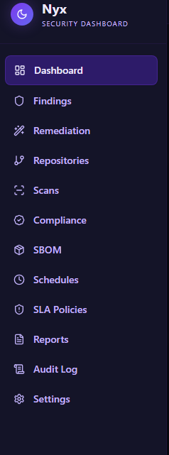
<!-- /IMAGE -->

---

## Dashboard (`/dashboard`)

The landing page after login. Shows the numbers that matter at a glance:

- **Open findings by severity** — critical / high / medium / low counts
- **SLA status card** — overdue, due soon, on track
- **Risk score over time** — 30-day trend line, org-wide
- **Regression banner** — surfaces re-appeared findings in the last 24 hours
- **Hot repos** — top repositories by new-finding velocity this week
- **Integration health chips** — green/red chips for each integration
- **Daily AI cost** — today's token spend at a glance

<!-- IMAGE: Full dashboard page with all cards populated.
     File: wiki/images/dashboard-full.png -->
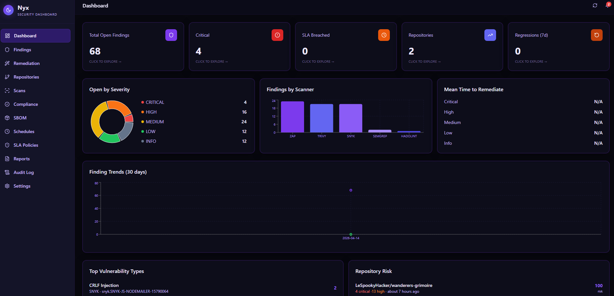
<!-- /IMAGE -->

---

## Findings (`/findings`)

The primary triage surface. All findings across all repos, filterable by:

- Severity
- Scanner
- Repository
- Status (OPEN, IN_REMEDIATION, FIXED, ACCEPTED_RISK, SUPPRESSED)
- Assignee
- Regression flag
- SLA status

Bulk actions (up to 20 at a time): **Request AI Fix**, **Generate Claude Code Prompt**, **Create JIRA Tickets**, **Suppress**, **Assign**.

<!-- IMAGE: Findings page with 20 rows selected and the bulk actions bar visible.
     File: wiki/images/findings-bulk.png -->
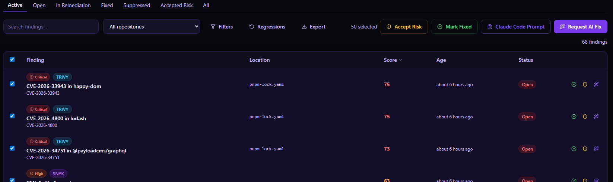
<!-- /IMAGE -->

### Finding detail (`/findings/:id`)

Full context for a single finding: the vulnerable code block, CVE / CWE references, EPSS, CVSS, priority score breakdown, related findings, AI remediation history, linked Jira tickets, audit trail, and the **Request AI Fix** button.

<!-- IMAGE: Finding detail page with code snippet and AI fix panel.
     File: wiki/images/finding-detail.png -->
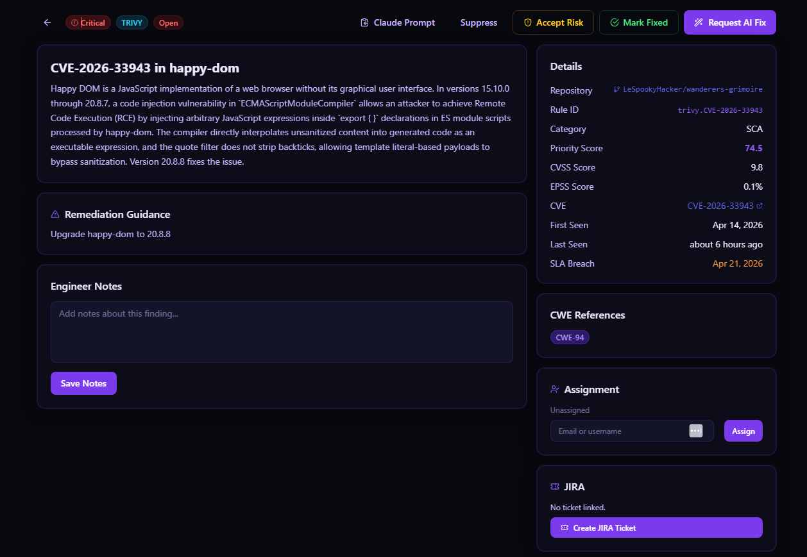
<!-- /IMAGE -->

---

## Repositories (`/repositories`)

List of registered repos with:

- Open findings count by severity
- Enabled scanners
- Last scan timestamp
- SLA status rollup
- **Push Workflow** button
- **Generate Repo Prompt** (bulk Claude Code prompt for all open findings)

### Repository detail (`/repositories/:id`)

Per-repo view: findings restricted to this repo, SBOM, scan history, SLA policy, scan schedule, JIRA project mapping, and the **Push Workflow** action.

<!-- IMAGE: Repository detail page with tabs for findings, SBOM, schedules.
     File: wiki/images/repo-detail.png -->
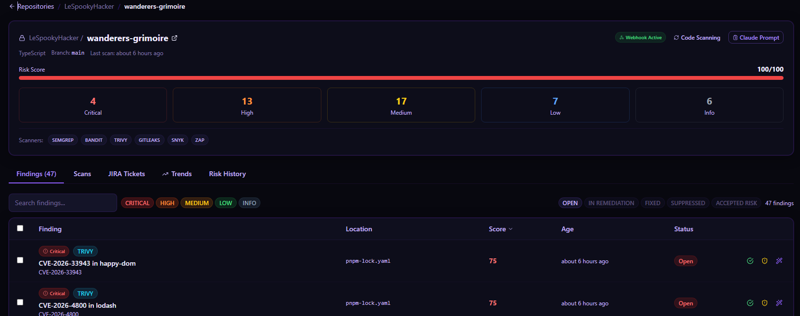
<!-- /IMAGE -->

---

## Scans (`/scans`)

Ingest history — every `POST /scans/import` call, the trigger, the commit, and the number of findings produced. Use it to debug CI wiring ("did the scan actually land?").

---

## Schedules (`/schedules`)

Configure recurring scans per repository. Intervals from 6 hours to 1 week. The scheduler worker polls every 5 minutes for due schedules and triggers a scan.

<!-- IMAGE: Schedules page with several repos on different intervals.
     File: wiki/images/schedules.png -->

<!-- /IMAGE -->

---

## SLA Policies (`/sla-policies`)

Define per-repository, per-severity SLA windows, escalation channels, and default Jira project. Policies stack in priority order — the most specific match wins.

<!-- IMAGE: SLA policies page showing a policy with different deadlines per severity.
     File: wiki/images/sla-policies.png -->
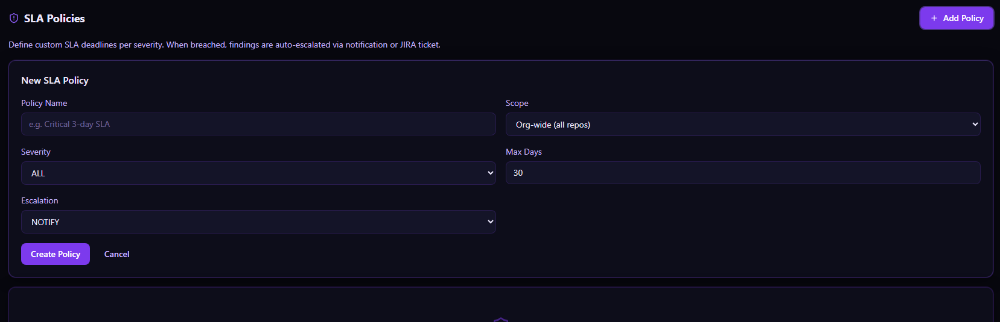
<!-- /IMAGE -->

---

## Remediation (`/remediation`)

All AI fix requests — pending, streaming, completed, low-confidence, or flagged by diff scanning. Each row shows status, the target finding, token cost, and the diff preview.

<!-- IMAGE: Remediation list with a low-confidence fix flagged in orange.
     File: wiki/images/remediation-list.png -->
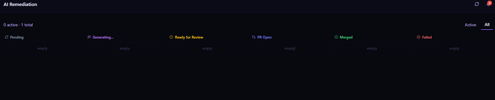
<!-- /IMAGE -->

---

## Compliance (`/compliance`)

Control coverage by framework. Pick PCI DSS, SOC 2, NIST 800-53, CIS, OWASP Top 10, or any custom framework you have defined. Each control shows:

- Coverage percentage
- Open findings mapped to it
- 30 / 60 / 90 day trend
- Linked repositories

<!-- IMAGE: Compliance page with PCI DSS selected and controls colored by coverage.
     File: wiki/images/compliance-pci.png -->
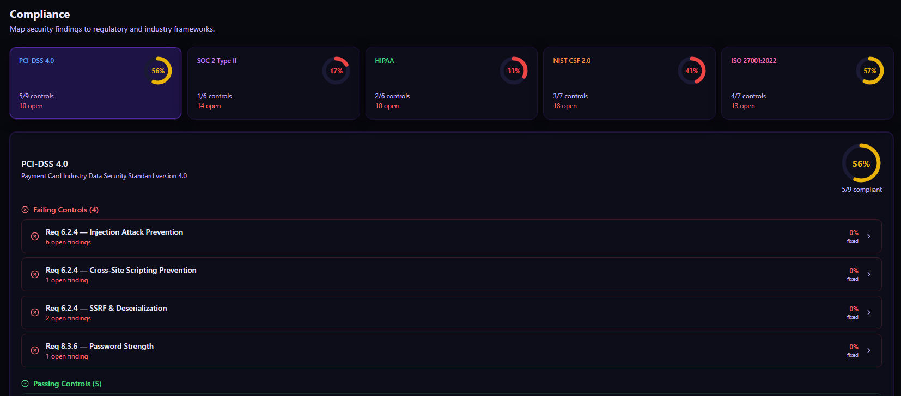
<!-- /IMAGE -->

---

## SBOM (`/sbom`)

Per-repo software bill of materials, latest vs previous, with a diff view for added / removed / upgraded components. Alerts fire when a new component is vulnerable or when an upgrade lands on a known-bad version.

<!-- IMAGE: SBOM diff view showing added and removed components.
     File: wiki/images/sbom-diff.png -->
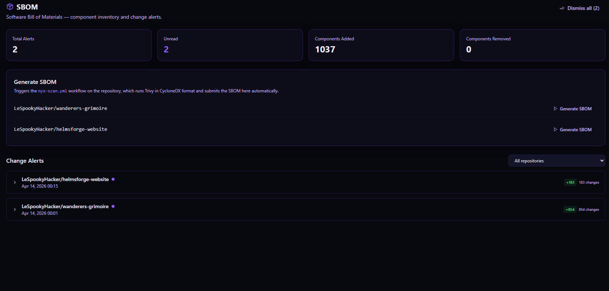
<!-- /IMAGE -->

---

## Reports (`/reports`)

- **Executive PDF** — one-click print-ready report for leadership
- **Velocity** — net-new vs fixed per day, burndown projection, MTTR breakdown
- **AI cost** — Claude token spend, daily trend, top-10 most expensive remediations
- **Risk over time** — per repo and org-wide

<!-- IMAGE: Reports page with the executive PDF preview rendered.
     File: wiki/images/reports-exec.png -->
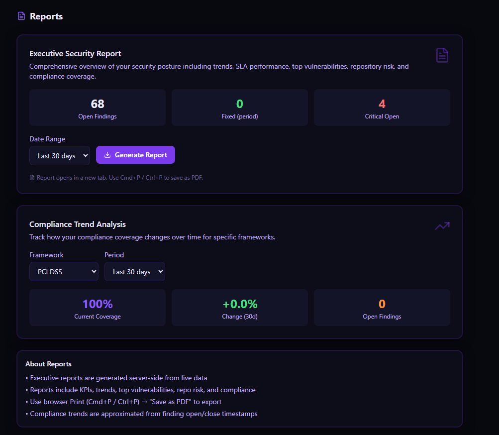
<!-- /IMAGE -->

---

## Audit (`/audit`)

Searchable, downloadable audit log with tamper-evident HMAC hash chain. Walk the full chain via **Verify Chain** — any gap or modification is flagged immediately.

<!-- IMAGE: Audit page with the verify-chain button and success banner.
     File: wiki/images/audit-page.png -->
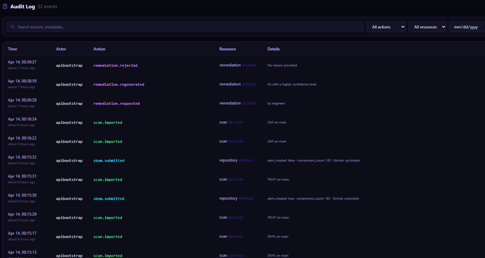
<!-- /IMAGE -->

---

## Settings (`/settings`)

- **API Keys** — create, rotate, revoke, set scope and expiry
- **User preferences** — dark/light toggle (dark by default), notification routing
- **Integrations** — view and re-test GitHub, JIRA, Anthropic, webhook
- **Custom compliance frameworks** — define your own
- **Dangerous actions** — seed demo data, wipe findings, reset DB

<!-- IMAGE: Settings page with the API Keys section expanded.
     File: wiki/images/settings-keys.png -->
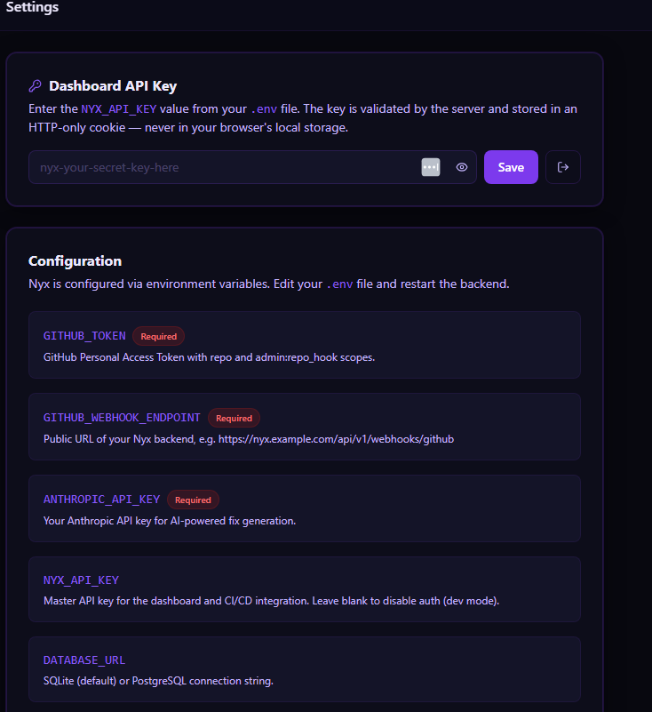
<!-- /IMAGE -->

---

## Alert bell

Top bar, bell icon. Two tabs:

- **SBOM drift** — component additions, removals, vulnerable upgrades
- **Regression auto-sort** — batches of findings that were auto-restored to ACCEPTED_RISK or SUPPRESSED

Each tab has its own unread counter; the badge on the bell is the sum.

<!-- IMAGE: Alert bell dropdown with both tabs visible.
     File: wiki/images/bell-dropdown.png -->
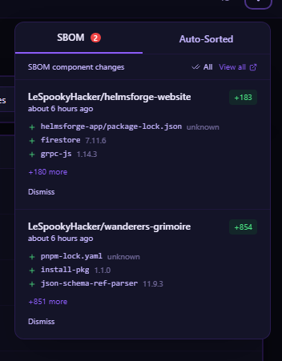
<!-- /IMAGE -->

---

## What next

- **Configure what each page shows →** [Configuration Reference](Configuration.md)
- **Hit the same data via the API →** [API Reference](API-Reference.md)
