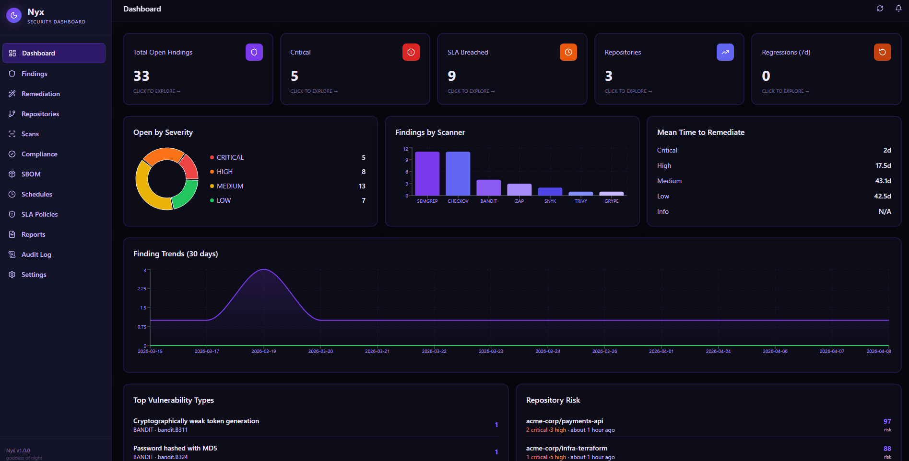
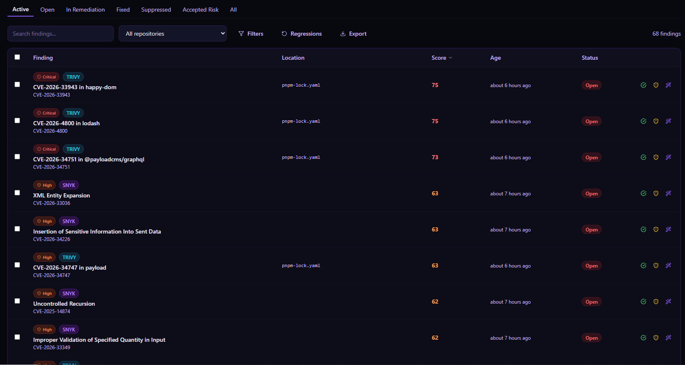
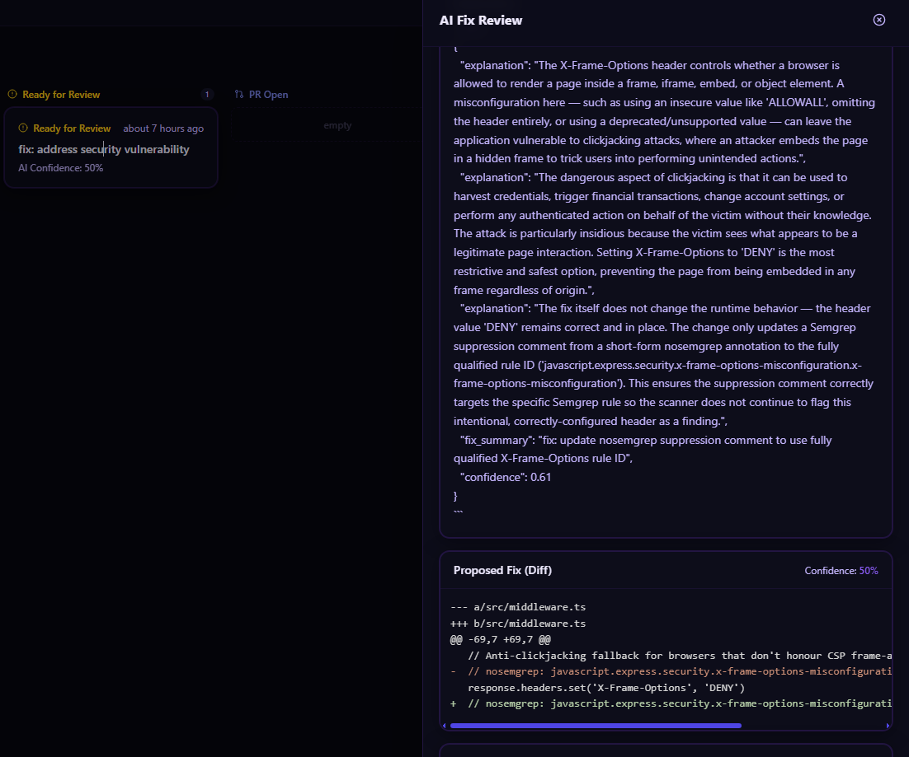

# First-Time Walkthrough

A 15-minute path from `git clone` to "I see findings and have an AI fix." Use this right after [Installation](Installation.md).

---

## What you'll have at the end

- Nyx running locally at http://localhost:3000
- One repository registered
- Real scan results flowing in from Semgrep
- One AI-generated fix visible in the Remediation page

---

## Step 1 — Install

If you haven't already:

```bash
git clone https://github.com/LeSpookyHacker/nyx.git
cd nyx
./setup.sh
```

Follow the prompts. At the end, `setup.sh` prints your dashboard URL and your API key. Save the API key somewhere — you will paste it in a moment.

---

## Step 2 — First login

Open **http://localhost:3000** → **Settings** → paste the API key → **Save**.

The dashboard now shows empty KPI cards — that is expected. You have not registered any repos yet.

---

## Step 3 — Load demo data (optional, 30 seconds)

Before wiring up a real repo, take a 30-second detour to see what a populated dashboard looks like:

```bash
docker compose exec backend python scripts/seed_demo_data.py
```

This creates ~3 demo repositories, ~200 findings across severities, a sample SBOM, and a few remediation records. It populates every page of the UI so you can click around before doing it for real.

Clean up later with:

```bash
docker compose exec backend python scripts/seed_demo_data.py --wipe
```

<!-- IMAGE: Dashboard populated with demo data.
     File: wiki/images/walkthrough-demo-data.png -->

<!-- /IMAGE -->

---

## Step 4 — Register your first real repository

Dashboard → **Repositories** → **Add Repository**.

Enter a repo you have push access to, e.g. `your-username/sample-app`. Enable Semgrep (fastest to try) plus anything else you want to experiment with. Click **Add**.

Nyx installs a GitHub webhook on the repository automatically. If you don't have a public URL yet, scans can still be pushed manually — see step 6.

> If this fails with 404 or 403, your GitHub token is missing permissions. Head to [GitHub Integration](GitHub-Integration.md) and come back.

---

## Step 5 — Push the scan workflow and configure GitHub secrets

### Push the workflow

On the repository detail page, click **Push Workflow**. Nyx commits `.github/workflows/nyx-scan.yml` to your repository via the GitHub API. This is the file that runs all the scanners on every push.

### Set the required secrets and variables

The pushed workflow needs to know where to send results. Go to your GitHub repository → **Settings → Secrets and variables → Actions** and add:

**Secrets:**

| Secret | Value |
|---|---|
| `NYX_API_KEY` | Create a `scanner`-scoped key in Nyx **Settings → API Keys** and paste it here |

**Variables:**

| Variable | Value |
|---|---|
| `NYX_URL` | The public URL of your Nyx instance — e.g. `https://abc123.ngrok.io` or `https://nyx.example.com` |
| `NYX_ZAP_TARGET` | *(Optional)* URL of your deployed app — e.g. `https://myapp.com`. Enables DAST scanning. |

> You do **not** need to set `NYX_REPO_ID` — the repository UUID is already embedded in the workflow file when Nyx pushes it.

Once set, go to your repo → **Actions → Nyx Security Scan → Run workflow** to trigger a manual test run and confirm results flow into Nyx.

---

## Step 6 — Grab the repository ID

You'll need it for the curl command in the next step:

```bash
curl -s -H "X-API-Key: $NYX_API_KEY" \
  http://localhost:8000/api/v1/repositories | jq '.items[] | {id, github_full_name}'
```

Copy the `id` for your newly added repo.

---

## Step 7 — Push a scan

Run Semgrep on the repo and push the results:

```bash
# From inside your target repo
pip install semgrep
semgrep --config=auto --json --output=/tmp/semgrep.json .

# Push to Nyx
curl -s -X POST "http://localhost:8000/api/v1/scans/import" \
  -H "Content-Type: application/json" \
  -H "X-API-Key: $NYX_API_KEY" \
  -d "$(jq -n --arg repo "$NYX_REPO_ID" --arg sha "$(git rev-parse HEAD)" --arg ref "$(git branch --show-current)" --slurpfile results /tmp/semgrep.json '{
    repository_id: $repo,
    scanner: "SEMGREP",
    git_ref: $ref,
    git_sha: $sha,
    trigger: "manual",
    results: $results[0]
  }')"
```

Expect `202 Accepted`. Open the **Findings** page — results should appear within a second.

<!-- IMAGE: Findings page populated with Semgrep results.
     File: wiki/images/walkthrough-findings.png -->

<!-- /IMAGE -->

---

## Step 8 — Request your first AI fix

Click any CRITICAL or HIGH finding → **Request AI Fix**. Watch the fix stream in via SSE — the diff appears token by token. When it completes:

- If confidence ≥ 0.7 and no diff warnings → you'll see an **Open PR** button.
- If flagged → review the banner and approve manually.

Click **Open PR**. Nyx pushes a branch, commits the fix, opens a PR on GitHub, and links it on the finding detail page.

<!-- IMAGE: Fix complete with PR link.
     File: wiki/images/walkthrough-fix-done.png -->

<!-- /IMAGE -->

---

## Step 9 — Merge the PR

Review the PR on GitHub, merge it. Within seconds:

- Nyx webhook receives the `pull_request.closed` event
- The finding flips to `FIXED`
- If JIRA is configured, the ticket transitions to `Done`
- The audit log records the close event with the merge SHA

---

## What you've accomplished

You have exercised the full loop: **scan → ingest → triage → AI fix → PR → merge → close**. Everything beyond this point is adding more repos, more scanners, more automation, and governance.

---

## What next

- **Set up recurring scans via schedules →** [Dashboard Guide → Schedules](Dashboard-Guide.md#schedules)
- **Wire scans into CI so you don't push manually →** [CI/CD Integration](CICD-Integration.md)
- **Define SLA policies for the team →** [SLA Policies](SLA-Policies.md)
- **Map findings to compliance frameworks →** [Compliance](Compliance.md)
